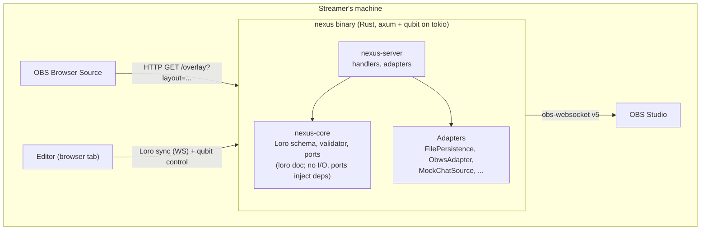

# CLAUDE.md

This file provides guidance to Claude Code (claude.ai/code) when working with code in this repository.

You are working on **Nexus**, a polished modular stream-overlay editor for non-technical streamers. Read this file first when a session opens in this directory. Pointers at the bottom take you to the deeper documents.

## What Nexus is, in one paragraph

A local-first overlay engine + visual editor. The streamer runs a Rust binary that serves a SvelteKit UI and exposes a typed RPC API via [qubit](https://github.com/andogq/qubit). They compose overlays in the editor (`/edit`), point OBS Browser Source at the overlay URL (`/overlay?layout=<id>`), and stream. Per [ADR-0005](docs/decisions/0005-offline-collaborative-loro-crdt-trusted-relay.md), workspace state is an **offline-collaborative Loro CRDT document** replicated to every editor; the Rust binary is a **trusted sync relay** (it merges, validates/repairs, persists a local Loro snapshot, and rebroadcasts) rather than the single source of truth. In v2 cloud mode, the same binary swaps adapters to use Postgres + auth + multi-tenancy. Wedge: one overlay replacing the typical assembly of StreamElements + Streamlabs + tip jar + now-playing widget, with taste-grade aesthetics + first-class viewer-interactivity.

## Origin

This project started as a Claude Design handoff bundle (visible context: `README.md` at the root, `project/` containing the prototype, `chats/chat1.md` with the original design conversation). The visual design from the prototype is canonical, recreate pixel-perfectly. The prototype's *internal structure* (React + Babel-in-browser) is not, the locked production stack is Rust + SvelteKit (see §16 of the spec).

If you're new here and something in the spec or this file is ambiguous, ask before assuming an implementation choice. The user has explicitly stated they want every technical detail surfaced rather than autonomously decided.

## Commands

Two workspaces live here: a **Cargo workspace** (`crates/*`) and a single **pnpm package** (`packages/app`). There is no root task runner; run frontend scripts with `pnpm -F app <script>` (or `cd packages/app` first), backend commands with `cargo`. Both toolchains are live (the older "no code yet" note is obsolete).

**Frontend (`packages/app`, SvelteKit 2 + Svelte 5 runes):**

| Goal | Command |
|---|---|
| Dev server (Vite + HMR) | `pnpm -F app dev` |
| Production build (static `build/`) | `pnpm -F app build` |
| Svelte + type check (keep at 0/0) | `pnpm -F app check` |
| Lint (`prettier --check` + `eslint`) | `pnpm -F app lint` |
| Auto-format | `pnpm -F app format` |
| Unit tests once (Vitest) | `pnpm -F app test:unit -- --run` |
| Unit tests in watch | `pnpm -F app test:unit` |
| One unit-test file | `pnpm -F app exec vitest run <path/to/x.svelte.test.ts>` |
| Unit tests by name | `pnpm -F app exec vitest run -t "<name>"` |
| Full gate (unit + e2e) | `pnpm -F app test` |
| E2e only (Playwright) | `pnpm -F app test:e2e` |
| One e2e file / by title | `pnpm -F app exec playwright test e2e/<x>.e2e.ts` / `... -g "<title>"` |

Vitest runs two projects: **`client`** (real headless Chromium, for `*.svelte.test.ts`) and **`server`** (node, for plain `*.test.ts`); narrow with `--project client|server`. `requireAssertions` is on, so every test needs an `expect`. The `client` project is browser-launched and can flake under full-suite parallelism; a file that fails in the full run usually passes when run alone.

**Backend (`crates/*`, Rust 2024 edition):**

| Goal | Command |
|---|---|
| Build / test all crates | `cargo build` / `cargo test` |
| One crate or one test | `cargo test -p nexus-core <name>` |
| Lint / format | `cargo clippy --all-targets` / `cargo fmt` |

**Run the editor + overlay end to end:**

```sh
pnpm -F app build
cargo run -p nexus-server -- serve --static-dir packages/app/build --data-dir .run-data
```

The relay (`nexus-server`, CLI name `nexus`) binds `127.0.0.1:7777` (`--port` / `NEXUS_PORT`), serves the built UI from `--static-dir` (`NEXUS_STATIC_DIR`), and persists a Loro snapshot under `--data-dir` (`NEXUS_DATA_DIR`, default OS app-data). Then open `http://localhost:7777/edit`; OBS points at `http://localhost:7777/overlay?layout=<id>`. The relay serves `build/` from disk per request, so after a rebuild a browser hard-refresh (not a restart) picks up the new bundle.

**E2e is serialized and self-building.** `playwright.config.ts`'s `webServer` runs `reset-data.mjs && pnpm build && cargo run -p nexus-server -- serve --port 4173 --static-dir build --data-dir .e2e-data`, so e2e rebuilds the UI and starts a real relay. With `fullyParallel: false` + `workers: 1`, all tests share one relay workspace, so each test sets up the state it asserts rather than assuming a fresh document.

**Visual reference (original prototype):** `cd project && python -m http.server 8765`, then open `http://localhost:8765/Stream%20Overlay.html`.

## Where the code lives

```
crates/
  nexus-core/      Pure core, no I/O: Loro schema (schema.rs), validate/repair over the
                   read model (validate.rs), read-model structs (model.rs), seeded
                   built-in themes (builtin_themes.rs), default workspace (default_doc.rs).
  nexus-server/    Trusted relay: clap CLI (cli.rs), WebSocket Loro sync (ws.rs +
                   protocol.rs), merge/validate/persist/rebroadcast runtime (runtime.rs),
                   file-snapshot persistence (persistence.rs), axum HTTP + static (http.rs).
packages/app/      SvelteKit UI (FSD). src/routes/{edit,overlay} are the two pages;
                   src/lib/{shared,entities,features} are the FSD layers; the local
                   loro-crdt replica + reactive store is shared/crdt; shared/ui holds the
                   Ark-backed primitives; e2e/ has the Playwright specs; messages/ +
                   project.inlang drive paraglide i18n.
docs/decisions/    ADRs (the "why"); docs/superpowers/specs/ holds the design spec ("what").
project/           Throwaway React prototype, canonical *visual* reference only.
```

## Tech stack (locked)

**Core (Rust):** Rust 1.84+ (2024 edition), Cargo workspace with `nexus-core` (hexagonal core) + `nexus-server` (the trusted sync relay: WebSocket sync, adapters, HTTP server). **`loro` for the CRDT workspace document** (per [ADR-0005](docs/decisions/0005-offline-collaborative-loro-crdt-trusted-relay.md)), axum for HTTP, tokio async runtime, serde for serialization, `obws` for obs-websocket (Rust-side, no JS bridge), sqlx for v2 cloud mode (deferred), `thiserror` for typed core errors, `anyhow` for glue-code errors, `tracing` for structured logging, clippy + rustfmt. qubit (RPC) is retained for the **control plane only** (auth, obs-control, workspace listing), not the document data-plane.

**UI (SvelteKit):** SvelteKit 2.x + Svelte 5 runes (`$state`, `$derived`, `$effect`). `@sveltejs/adapter-static`, filesystem routing, **`loro-crdt`** as the local replica and reactive store for document state (Svelte runes subscribe to Loro diffs), `@qubit-rs/client` for the control-plane RPC. Svelte built-in transitions + GSAP if needed. `lucide-svelte` for icons. **`@ark-ui/svelte`** (headless, accessible components behind `shared/ui` wrappers, styled with the token system) and **`culori`** (oklch conversion for the theme color picker), per [ADR-0008](docs/decisions/0008-adopt-ark-ui.md); editor-only, the `/overlay` bundle stays Ark-free. Scoped `<style>` + CSS custom properties. `modern-normalize`. (Per [ADR-0005](docs/decisions/0005-offline-collaborative-loro-crdt-trusted-relay.md), `@tanstack/svelte-query` is no longer used for document state.)

**Toolchain:** Node 22 LTS, pnpm, cargo-dist (axodotdev) for cross-platform binaries, Vitest + Testing Library + Playwright for tests, ESLint + `eslint-plugin-svelte` + Prettier. (`eslint-plugin-boundaries` is planned but **not yet installed**; FSD layering is a convention until it is added.)

Full details in [`docs/superpowers/specs/2026-05-13-stream-overlay-editor-design.md`](docs/superpowers/specs/2026-05-13-stream-overlay-editor-design.md) §16.

## Organizing methodology

**Feature-Sliced Design (FSD) v2.1** for the SvelteKit UI. Layers: `app/` → `pages/` (filesystem routes) → `widgets/` → `features/` → `entities/` → `shared/`. **A module may only import from layers strictly below it.** Same-layer cross-imports are forbidden, this is currently a **convention** (`eslint-plugin-boundaries` is planned but not yet installed; see Tech stack).

**FSD principle from the official skill: "Start simple, extract when needed."** Don't pre-populate `entities/`, `features/`, `widgets/` with empty folders. Begin with code in `pages/`; extract a layer only when actual reuse appears in ≥2 places and the usages don't always change together.

**Hexagonal discipline within slices.** Each slice has segments: `model/` (PURE, no I/O, no DOM, no time, no randomness; time and randomness arrive as injected ports), `api/` (impure adapters, returns `Result<T, E>` on failure), `ui/` (presentation, depends on `model/` + `shared/ui/`), `lib/` (slice-internal utilities), `config/` (static data). `model/` purity is a convention until the boundaries lint is installed.

**Crate boundaries enforce the same discipline in Rust.** `nexus-core` imports nothing from `nexus-server`. Verified by `cargo tree`.

## How the pieces fit together (big picture)



- Per [ADR-0005](docs/decisions/0005-offline-collaborative-loro-crdt-trusted-relay.md), every editor holds a **local Loro replica** and edits apply locally (offline-capable); the Rust binary is a **trusted relay** that merges, validates/repairs, persists, and rebroadcasts. `/overlay` is a read-only replica. (The diagram above predates ADR-0005: the editor↔binary channel is now Loro sync over WebSocket plus control-plane qubit, and `nexus-core` holds a validator over the Loro document rather than a Decider with `evolve`.)
- Local mode: workspace JSON files in OS app-data dir, no auth, single tenant.
- Cloud mode (v2, deferred): same binary; swap `FilePersistence` → `DatabasePersistence` and `NoOpAuth` → `OAuthAuth` via env-var config.
- All cross-context communication goes through the event bus / qubit. No feature imports another feature directly.

The key documents to understand this fully: §3 (architecture) and §6 (ports and adapters) of the spec; [ADR-0002](docs/decisions/0002-local-or-cloud-rust-core-with-qubit-rpc.md) for the architectural rationale.

## The nine project rules (non-negotiable)

These are pinned in the spec at §15 and applied to every PR.

1. **Shell calls core. Core does not call shell.** (Bittencourt's functional-core/imperative-shell rule.)
2. **Core has no clock, no randomness, no I/O, no DOM, no network.** Time and randomness arrive as injected ports (`Clock`, `Random` traits in `nexus-core`). *(ADR-0005: `nexus-core` may depend on the `loro` crate, in-memory CRDT state, not storage.)*
3. ~~**State mutates only through Command → Decide → Events → Evolve.**~~ *(ADR-0005: superseded, the document mutates via local Loro ops and CRDT merge; undo is Loro's `UndoManager`.)*
4. **`decide` is pure and total.** *(ADR-0005: `decide` is now a pure validator/repair function over the read model, `validate(workspace) -> Vec<Repair>`; there is no `evolve`/event log, Loro is the state and the op-log.)*
5. **Fallible operations at port boundaries return `Result<T, E>`. No throws across ports.** Use `thiserror` for typed core errors, `anyhow` for glue. Convert to RFC 9457 Problem Details at the HTTP boundary (per [ADR-0001](docs/decisions/0001-use-rfc-9457-problem-details-for-http-errors.md)).
6. **Aggregate lifecycles with ≥3 gated states are discriminated unions (Rust `enum`).** Specifically: `Workspace.mode` (live | draft), `ObsConnection` (disconnected | connecting | connected | failed), `Layout.status` (active | archived).
7. **Bounded contexts publish events; they do not import each other.** Cross-context contracts live in `shared/lib/` (TS) or `nexus-core::shared` (Rust). Same-layer imports between features are a lint error.
8. **Immutable by default (Rust) / `readonly` (TS) for the read model.** No DTOs. *(ADR-0005: the `LoroDoc` is the mutable collaborative state by design; the discipline applies to the plain read-model structs and to snapshots/messages crossing boundaries.)*
9. **Editor animations are restrained (≤ 300 ms, `ease-out`, never `ease-in-out`). Overlay-runtime animations earn their length by being rare and communicative.** Two budgets in one codebase.

## Working methodology (Akita-style XP with AI)

> *"IA programando sozinha é a receita pro desastre. O que funciona é algo que já tem nome e décadas de história: Extreme Programming."*, Akita

When working on Nexus with AI as the pair-programmer:

- **Iterative, not one-shot.** Each feature is a sequence of small commits, not a single mega-prompt. Refine the slice, then move on.
- **TDD by default.** Write failing tests, then make them pass, then refactor. The pure-core layers (`nexus-core`, FSD `model/` segments) are tested without any I/O, just `cargo test` and `vitest`.
- **Small, classified commits.** Conventional Commits format (`feat:`, `fix:`, `refactor:`, `test:`, `docs:`, `chore:`). One coherent change per commit. Akita's reference cadence: roughly one commit per 15–25 minutes of productive work.
- **Expect a non-feature majority.** Roughly two-thirds of implementation work is hardening, testing, infra, and docs, not new features. Set that frame from the start. (Detailed planning calibration lives in the spec's verification section, not here.)
- **Verify before claiming complete.** Run the test suite, run the linter, run the type-checker. The harness's pre-commit hooks catch most of this; failing hooks mean the work isn't done. Never bypass with `--no-verify`.
- **Never edit accepted ADRs.** When a decision changes, write a new ADR that supersedes the old. The history is the point.
- **Read the FSD skill when in doubt about file placement.** Installed at `.agents/skills/feature-sliced-design/SKILL.md` plus 7 `references/` files covering edges (asset handling, cross-imports, framework integration, etc.).

## Where to read next

In rough order of urgency for a new agent session:

1. **The design spec**, [`docs/superpowers/specs/2026-05-13-stream-overlay-editor-design.md`](docs/superpowers/specs/2026-05-13-stream-overlay-editor-design.md), the canonical *current state* of the design. ~3,000 lines of structured prose. The spec describes the system as it should be built; it does not describe how we got here.
2. **The ADR index**, [`docs/decisions/README.md`](docs/decisions/README.md), the *historical* record of decisions, with rationale and rejected alternatives. The spec is "what"; the ADRs are "why." Accepted ADRs as of 2026-06-01:
   - [ADR-0000](docs/decisions/0000-record-architecture-decisions.md), Record architecture decisions (meta-ADR establishing MADR 4.0 + backlog of decisions to backfill).
   - [ADR-0001](docs/decisions/0001-use-rfc-9457-problem-details-for-http-errors.md), Use RFC 9457 Problem Details for HTTP error responses.
   - [ADR-0002](docs/decisions/0002-local-or-cloud-rust-core-with-qubit-rpc.md), Local-or-cloud Rust core with qubit RPC and SvelteKit UI **(superseded by ADR-0005)**.
   - [ADR-0003](docs/decisions/0003-dark-first-pro-creative-tool-editor-aesthetic.md), Dark-first pro-creative-tool editor aesthetic.
   - [ADR-0004](docs/decisions/0004-responsive-editor-shell.md), Responsive editor shell (CSS-owned reflow, container-query panels, off-canvas drawers).
   - [ADR-0005](docs/decisions/0005-offline-collaborative-loro-crdt-trusted-relay.md), Offline-collaborative local-first architecture on Loro CRDT with a trusted sync relay.
   - [ADR-0006](docs/decisions/0006-data-driven-custom-themes.md), Data-driven custom themes with a hybrid registry and token linking **(superseded by ADR-0007)**.
   - [ADR-0007](docs/decisions/0007-pure-data-driven-themes.md), Pure data-driven themes (every theme is registry data; built-ins are seeded as protected entries).
   - [ADR-0008](docs/decisions/0008-adopt-ark-ui.md), Adopt Ark UI (headless) for the editor component layer, behind `shared/ui` wrappers; editor-only, the `/overlay` bundle stays Ark-free.
3. **The FSD skill**, [`.agents/skills/feature-sliced-design/SKILL.md`](.agents/skills/feature-sliced-design/SKILL.md), official Feature-Sliced Design v2.1 with practical guidance. Read when placing new code. Version pinned via [`skills-lock.json`](skills-lock.json) at the project root.
4. **The original prototype**, [`project/Stream Overlay.html`](project/Stream Overlay.html) + the 8 JSX modules in [`project/`](project/), the design-medium artifact that started this. React + Babel-in-browser. The visual design is canonical; the implementation is throwaway prototype quality.
5. **The handoff chat**, [`chats/chat1.md`](chats/chat1.md), the original design conversation that produced the prototype.

The user-global CLAUDE.md at `C:\Users\umaru\.claude\CLAUDE.md` adds personal preferences (e.g., the user's notes vault at `D:\Notes\`, current date conventions) that override anything here on conflict.

## Honest current state (as of 2026-06-01)

The walking skeleton is implemented and the gate is green (svelte-check 0/0, eslint, Vitest, Playwright):

- **Backend.** `nexus-core` holds the Loro schema, the `validate`/repair pass over the read model, the read-model structs, and the seeded built-in themes; `nexus-server` is the trusted relay (WebSocket Loro sync, validate-on-merge, `FilePersistence` snapshot, rebroadcast, static-asset serving) behind a clap `serve` CLI.
- **Frontend.** The `/edit` editor (titlebar with a centered command-palette trigger, tool rail, scene strip, widgets + inspector panels, theme builder, command palette) and the read-only `/overlay` renderer, both driven by a local `loro-crdt` replica synced over WebSocket. Eight overlay widgets, pure data-driven themes (ADR-0007), Ark UI form controls (ADR-0008) behind `shared/ui`, and self-hosted Geist fonts.
- **Not yet built.** The qubit control plane and OBS control (`obws`) are not wired (neither crate depends on them yet); live/draft mode, layout switching, and real event sources are stubbed (chat/alerts run off a mock source in `shared/events`); v2 cloud mode (Postgres/auth) is deferred.
- `eslint-plugin-boundaries` is still not installed, so FSD layering and `model/` purity remain conventions, not enforced.
- A few spec questions remain open (DESIGN.md adoption for themes, the Appearance/Theme coupling decision, the density-cut decision, the §10.4 sync note). Minor; pick them up when relevant.
