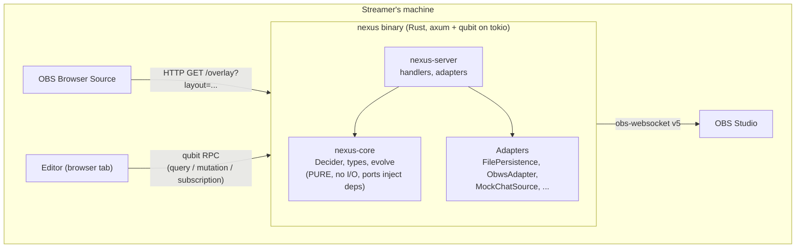

# CLAUDE.md

This file provides guidance to Claude Code (claude.ai/code) when working with code in this repository.

You are working on **Nexus**, a polished modular stream-overlay editor for non-technical streamers. Read this file first when a session opens in this directory. Pointers at the bottom take you to the deeper documents.

## What Nexus is, in one paragraph

A local-first overlay engine + visual editor. The streamer runs a Rust binary that serves a SvelteKit UI and exposes a typed RPC API via [qubit](https://github.com/andogq/qubit). They compose overlays in the editor (`/edit`), point OBS Browser Source at the overlay URL (`/overlay?layout=<id>`), and stream. The Rust server is the single source of truth, workspace state lives in JSON files on disk locally; in v2 cloud mode, the same binary swaps adapters to use Postgres + auth + multi-tenancy. Wedge: *"one overlay, not seven services"*, taste-grade aesthetics + first-class viewer-interactivity, replacing the typical assembly of StreamElements + Streamlabs + tip jar + now-playing widget.

## Origin

This project started as a Claude Design handoff bundle (visible context: `README.md` at the root, `project/` containing the prototype, `chats/chat1.md` with the original design conversation). The visual design from the prototype is canonical, recreate pixel-perfectly. The prototype's *internal structure* (React + Babel-in-browser) is not, the locked production stack is Rust + SvelteKit (see §16 of the spec).

If you're new here and something in the spec or this file is ambiguous, ask before assuming an implementation choice. The user has explicitly stated they want every technical detail surfaced rather than autonomously decided.

## Commands

**State as of 2026-05-13:** No production code or build system exists yet. The commands below cover what works today; the locked tech stack's commands (`cargo build`, `pnpm dev`, etc.) will land when implementation starts.

| Goal | Command |
|---|---|
| Serve the visual-reference prototype | `cd project && python -m http.server 8765` then open `http://localhost:8765/Stream%20Overlay.html` |
| Re-install / update the FSD skill | `npx -y skills add https://github.com/feature-sliced/skills --skill feature-sliced-design` |
| Inspect the design spec | Read `docs/superpowers/specs/2026-05-13-stream-overlay-editor-design.md` |
| Inspect ADRs | Read `docs/decisions/README.md` for the index |

Once implementation begins, this section should grow to include the commands for the locked stack (see §16 of the design spec for the full toolchain).

## Tech stack (locked)

**Core (Rust):** Rust 1.84+ (2024 edition), Cargo workspace with `nexus-core` (pure functional core) + `nexus-server` (qubit handlers, adapters, HTTP server). qubit for RPC, axum for HTTP, tokio async runtime, serde for serialization, `obws` for obs-websocket (Rust-side, no JS bridge), sqlx for v2 cloud mode (deferred), `thiserror` for typed core errors, `anyhow` for glue-code errors, `tracing` for structured logging, clippy + rustfmt.

**UI (SvelteKit):** SvelteKit 2.x + Svelte 5 runes (`$state`, `$derived`, `$effect`). `@sveltejs/adapter-static`, filesystem routing, `@qubit-rs/client` for RPC transport, **`@tanstack/svelte-query` (v5)** for client-side cache + mutations + optimistic updates. Svelte built-in transitions + GSAP if needed. `lucide-svelte` for icons. Scoped `<style>` + CSS custom properties. `modern-normalize`.

**Toolchain:** Node 22 LTS, pnpm, cargo-dist (axodotdev) for cross-platform binaries, Vitest + Testing Library + Playwright for tests, ESLint + `eslint-plugin-boundaries` + `eslint-plugin-svelte` + Prettier.

Full details in [`docs/superpowers/specs/2026-05-13-stream-overlay-editor-design.md`](docs/superpowers/specs/2026-05-13-stream-overlay-editor-design.md) §16.

## Organizing methodology

**Feature-Sliced Design (FSD) v2.1** for the SvelteKit UI. Layers: `app/` → `pages/` (filesystem routes) → `widgets/` → `features/` → `entities/` → `shared/`. **A module may only import from layers strictly below it.** Same-layer cross-imports are forbidden, enforced by `eslint-plugin-boundaries`.

**FSD principle from the official skill: "Start simple, extract when needed."** Don't pre-populate `entities/`, `features/`, `widgets/` with empty folders. Begin with code in `pages/`; extract a layer only when actual reuse appears in ≥2 places and the usages don't always change together.

**Hexagonal discipline within slices.** Each slice has segments: `model/` (PURE, no I/O, no DOM, no time, no randomness; time and randomness arrive as injected ports), `api/` (impure adapters, returns `Result<T, E>` on failure), `ui/` (presentation, depends on `model/` + `shared/ui/`), `lib/` (slice-internal utilities), `config/` (static data). Lint enforces `model/` purity.

**Crate boundaries enforce the same discipline in Rust.** `nexus-core` imports nothing from `nexus-server`. Verified by `cargo tree`.

## How the pieces fit together (big picture)

- The Rust binary owns workspace state authoritatively. Both routes (`/edit` and `/overlay`) are subscribers; mutations always go through the server.
- Local mode: workspace JSON files in OS app-data dir, no auth, single tenant.
- Cloud mode (v2, deferred): same binary; swap `FilePersistence` → `DatabasePersistence` and `NoOpAuth` → `OAuthAuth` via env-var config.
- All cross-context communication goes through the event bus / qubit. No feature imports another feature directly.

The key documents to understand this fully: §3 (architecture) and §6 (ports and adapters) of the spec; [ADR-0002](docs/decisions/0002-local-or-cloud-rust-core-with-qubit-rpc.md) for the architectural rationale.

## The nine project rules (non-negotiable)

These are pinned in the spec at §15 and applied to every PR.

1. **Shell calls core. Core does not call shell.** (Bittencourt's functional-core/imperative-shell rule.)
2. **Core has no clock, no randomness, no I/O, no DOM, no storage.** Time and randomness arrive as injected ports (`Clock`, `Random` traits in `nexus-core`).
3. **State mutates only through Command → Decide → Events → Evolve.** No direct setters on workspace state. Undo is event-log reversal in `nexus-server`'s Runtime.
4. **`decide` is pure and total. `evolve` is mechanical.** All business logic lives in `decide`. `evolve` only sets fields, adds to lists, increments, or toggles flags. (Chassaing's Decider pattern.)
5. **Fallible operations at port boundaries return `Result<T, E>`. No throws across ports.** Use `thiserror` for typed core errors, `anyhow` for glue. Convert to RFC 9457 Problem Details at the HTTP boundary (per [ADR-0001](docs/decisions/0001-use-rfc-9457-problem-details-for-http-errors.md)).
6. **Aggregate lifecycles with ≥3 gated states are discriminated unions (Rust `enum`).** Specifically: `Workspace.mode` (live | draft), `ObsConnection` (disconnected | connecting | connected | failed), `Layout.status` (active | archived).
7. **Bounded contexts publish events; they do not import each other.** Cross-context contracts live in `shared/lib/` (TS) or `nexus-core::shared` (Rust). Same-layer imports between features are a lint error.
8. **All types are `readonly` end-to-end (TS) / immutable by default (Rust).** No DTOs. The shape leaving the core is the shape arriving at the UI, the wire, the persistence layer.
9. **Editor animations are restrained (≤ 300 ms, `ease-out`, never `ease-in-out`). Overlay-runtime animations earn their length by being rare and communicative.** Two budgets in one codebase.

## Working methodology (Akita-style XP with AI)

> *"IA programando sozinha é a receita pro desastre. O que funciona é algo que já tem nome e décadas de história: Extreme Programming."*, Akita

When working on Nexus with AI as the pair-programmer:

- **Iterative, not one-shot.** Each feature is a sequence of small commits, not a single mega-prompt. Refine the slice, then move on.
- **TDD by default.** Write failing tests, then make them pass, then refactor. The pure-core layers (`nexus-core`, FSD `model/` segments) are tested without any I/O, just `cargo test` and `vitest`.
- **Small, classified commits.** Conventional Commits format (`feat:`, `fix:`, `refactor:`, `test:`, `docs:`, `chore:`). One coherent change per commit. Akita's reference cadence: roughly one commit per 15–25 minutes of productive work.
- **Expect a non-feature majority.** Roughly two-thirds of implementation work is hardening, testing, infra, and docs, not new features. Set that frame from the start. (Detailed planning calibration lives in the spec's verification section, not here.)
- **Verify before claiming complete.** Run the test suite, run the linter, run the type-checker. The harness's pre-commit hooks catch most of this; failing hooks mean the work isn't done. Never bypass with `--no-verify`.
- **Never edit accepted ADRs.** When a decision changes, write a new ADR that supersedes the old. The history is the point.
- **Read the FSD skill when in doubt about file placement.** Installed at `.agents/skills/feature-sliced-design/SKILL.md` plus 7 `references/` files covering edges (asset handling, cross-imports, framework integration, etc.).

## Where to read next

In rough order of urgency for a new agent session:

1. **The design spec**, [`docs/superpowers/specs/2026-05-13-stream-overlay-editor-design.md`](docs/superpowers/specs/2026-05-13-stream-overlay-editor-design.md), the canonical *current state* of the design. ~3,000 lines of structured prose. The spec describes the system as it should be built; it does not describe how we got here.
2. **The ADR index**, [`docs/decisions/README.md`](docs/decisions/README.md), the *historical* record of decisions, with rationale and rejected alternatives. The spec is "what"; the ADRs are "why." Accepted ADRs as of 2026-05-13:
   - [ADR-0000](docs/decisions/0000-record-architecture-decisions.md), Record architecture decisions (meta-ADR establishing MADR 4.0 + backlog of decisions to backfill).
   - [ADR-0001](docs/decisions/0001-use-rfc-9457-problem-details-for-http-errors.md), Use RFC 9457 Problem Details for HTTP error responses.
   - [ADR-0002](docs/decisions/0002-local-or-cloud-rust-core-with-qubit-rpc.md), Local-or-cloud Rust core with qubit RPC and SvelteKit UI.
3. **The FSD skill**, [`.agents/skills/feature-sliced-design/SKILL.md`](.agents/skills/feature-sliced-design/SKILL.md), official Feature-Sliced Design v2.1 with practical guidance. Read when placing new code. Version pinned via [`skills-lock.json`](skills-lock.json) at the project root.
4. **The original prototype**, [`project/Stream Overlay.html`](project/Stream Overlay.html) + the 8 JSX modules in [`project/`](project/), the design-medium artifact that started this. React + Babel-in-browser. The visual design is canonical; the implementation is throwaway prototype quality.
5. **The handoff chat**, [`chats/chat1.md`](chats/chat1.md), the original design conversation that produced the prototype.

The user-global CLAUDE.md at `C:\Users\umaru\.claude\CLAUDE.md` adds personal preferences (e.g., the user's notes vault at `D:\Notes\`, current date conventions) that override anything here on conflict.

## Honest current state (as of 2026-05-13)

- The design spec, the ADR system, and this CLAUDE.md are in place.
- The FSD skill is installed at `.agents/skills/feature-sliced-design/`.
- The original prototype has been extracted into `project/` and runs locally (Python http.server) for visual reference.
- **No production code exists yet.** The next phase is the implementation plan (probably authored by invoking the `writing-plans` skill), then iterative implementation with TDD discipline.
- A few questions remain open in the spec (DESIGN.md adoption for themes, Appearance × Theme coupling decision, density-cut decision, the §10.4 sync note). These are minor; pick them up when relevant.
