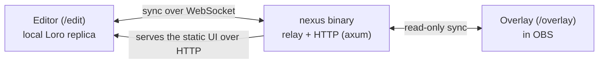

# Nexus

**One overlay, not seven services.**

Most stream overlays are a pile of browser sources held together with hope: StreamElements for alerts, Streamlabs for the tip jar, another tab for now-playing, and a notes file full of URLs you are afraid to touch. Nexus is the alternative, one overlay you actually design, in one place.

You lay it out visually in the browser, point an OBS Browser Source at it, and go live. The whole thing runs as a single Rust binary on your own machine; no account, no cloud, nothing to sign up for. Your workspace is stored locally as a CRDT, so it keeps working when your wifi does not, and the editor treats taste as a feature rather than an afterthought.

> **Status: early, but real.** The skeleton walks. You can compose overlays, theme them, and watch them render live in OBS, and the test suite is green. Plenty is still stubbed (OBS control, live versus draft mode, the cloud version), and the [Current status](#current-status) section is honest about exactly what.

## How it works

Three pieces, one binary:



- **The editor (`/edit`)** is where you work. It keeps its own copy of the document, so edits land instantly and survive going offline.
- **The overlay (`/overlay`)** is the transparent, read-only view OBS loads. It mirrors your active scene and restyles itself the moment you change a theme.
- **The relay** (the `nexus` binary) is the quiet one in the middle: it merges everyone's edits, fixes up anything inconsistent, saves a local snapshot, and hands the result back out.

If you want the reasoning behind that shape (a local-first [Loro](https://loro.dev) CRDT with the binary as a trusted relay rather than the source of truth), it lives in [ADR-0005](docs/decisions/0005-offline-collaborative-loro-crdt-trusted-relay.md).

## Quickstart

You will need Rust 1.84+ (2024 edition), Node 22 LTS, and [pnpm](https://pnpm.io).

```sh
# install JS deps and build the static UI
pnpm install
pnpm -F app build

# run the relay (serves the UI and the /sync WebSocket on 127.0.0.1:7777)
cargo run -p nexus-server -- serve --static-dir packages/app/build --data-dir .run-data
```

Now open the editor at <http://localhost:7777/edit>, and point an OBS Browser Source at <http://localhost:7777/overlay> (add `?layout=<id>` to pin a specific layout; otherwise it follows whichever one is active).

The relay reads the built UI fresh from disk on every request, so after a rebuild you just refresh the tab; no restart needed. Port and paths are configurable: `--port` / `NEXUS_PORT`, `--static-dir` / `NEXUS_STATIC_DIR`, and `--data-dir` / `NEXUS_DATA_DIR` (which defaults to your OS app-data folder). Tweaking only the UI? Skip the build and run `pnpm -F app dev` for hot reload.

## Tech stack

- **Core (Rust 2024).** A Cargo workspace split in two. `nexus-core` is pure and I/O-free: the Loro schema, the read-model structs, a validate-and-repair pass, and the seeded built-in themes. `nexus-server` is the trusted relay around it: WebSocket sync, snapshot persistence, and an axum HTTP server behind a clap CLI. Loro does the CRDT work; tokio does the async.
- **UI (SvelteKit 2 + Svelte 5 runes).** `loro-crdt` is the local replica and the reactive store in one. [Ark UI](https://ark-ui.com) supplies the accessible editor controls (editor-only, so the overlay bundle stays small), and the chrome is set in a self-hosted [Geist](https://vercel.com/font). The build is fully static, via `@sveltejs/adapter-static`.

## Development

Two toolchains share the repo: a Cargo workspace (`crates/*`) and a single pnpm package (`packages/app`). There is no root task runner, so reach for `pnpm -F app <script>` on the front end and `cargo` on the back.

| Goal | Command |
|---|---|
| UI dev server (Vite + HMR) | `pnpm -F app dev` |
| Build the static UI | `pnpm -F app build` |
| Svelte + type check | `pnpm -F app check` |
| Lint / auto-format | `pnpm -F app lint` / `pnpm -F app format` |
| Unit tests (Vitest) | `pnpm -F app test:unit -- --run` |
| End-to-end tests (Playwright) | `pnpm -F app test:e2e` |
| Full UI gate (unit + e2e) | `pnpm -F app test` |
| Build / test the Rust crates | `cargo build` / `cargo test` |
| Lint / format Rust | `cargo clippy --all-targets` / `cargo fmt` |

The front end follows [Feature-Sliced Design](https://feature-sliced.design): every slice keeps a pure `model/` apart from its impure `api/` adapters and its `ui/`. The Rust core never reaches into the server crate; the dependency only points one way.

## Repository layout

```
crates/
  nexus-core/    Pure core: Loro schema, read model, validate/repair, seeded themes
  nexus-server/  Trusted relay: clap CLI, WebSocket sync, persistence, axum HTTP
packages/app/    SvelteKit UI (Feature-Sliced Design); the /edit and /overlay routes
docs/decisions/  Architecture Decision Records (the "why")
docs/superpowers/specs/   The design spec (the "what")
```

## Current status

The skeleton walks, and the gate is green (svelte-check, eslint, Vitest, Playwright). What is real today:

- The `/edit` editor (command palette, tool rail, scene strip, widget and inspector panels, theme builder) and the read-only `/overlay` renderer, both driven by a local `loro-crdt` replica synced over WebSocket.
- Eight overlay widgets, fully data-driven themes, and the self-hosted Geist typeface.

What is not here yet: OBS control (obs-websocket), live versus draft mode, layout switching, real event sources (chat and alerts run off a mock source for now), and the v2 cloud mode (Postgres and auth).

## Documentation

- **The design spec**, the current "what": [`docs/superpowers/specs/`](docs/superpowers/specs/)
- **The ADRs**, the historical "why" with the roads not taken: [`docs/decisions/`](docs/decisions/README.md)
- **Contributing and working with agents**: [`AGENTS.md`](AGENTS.md)
- **Release notes**: [`CHANGELOG.md`](CHANGELOG.md)

## Origin

Nexus started life as a visual mockup made in an AI design tool, then handed off to be built for real. The look from that mockup is the canonical target and is recreated faithfully; its throwaway internals are not, and the Rust and SvelteKit stack was chosen on its own merits.

## License

Not chosen yet. The bundled Geist typeface is a separate matter: it ships under the SIL Open Font License 1.1 (see [`packages/app/src/lib/shared/styles/fonts/OFL.txt`](packages/app/src/lib/shared/styles/fonts/OFL.txt)).
